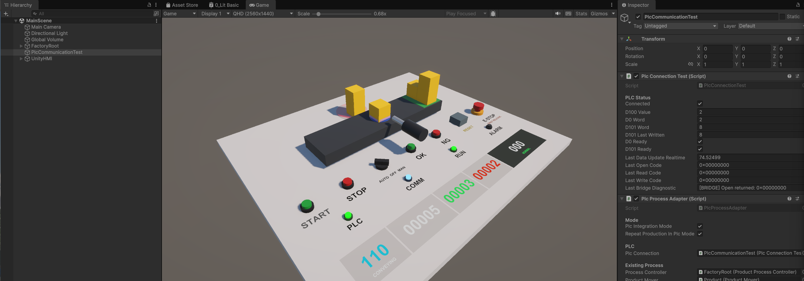
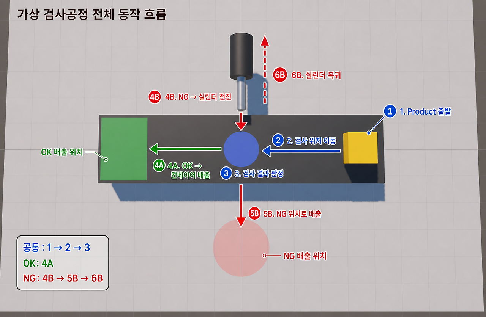
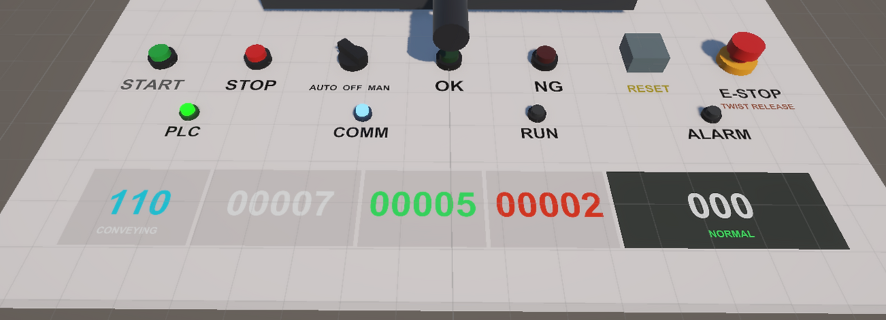
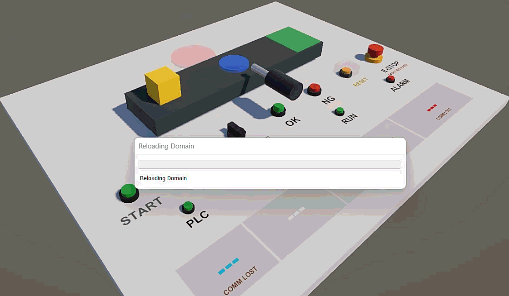
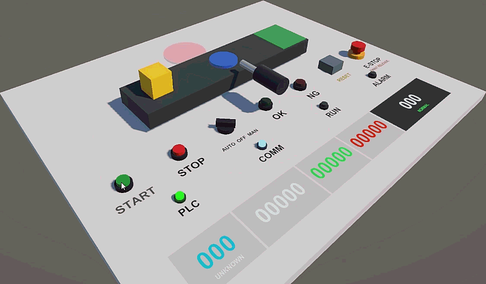
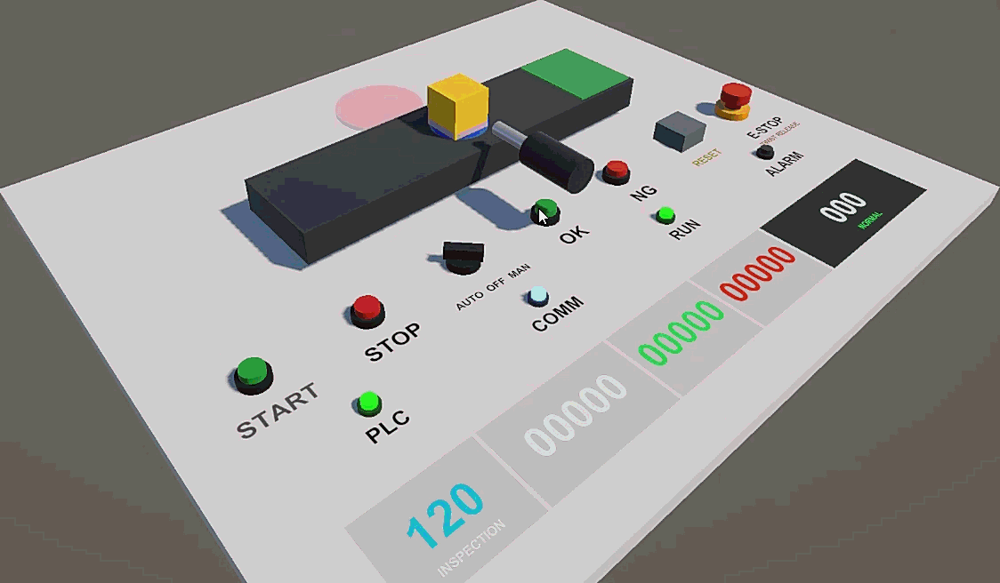
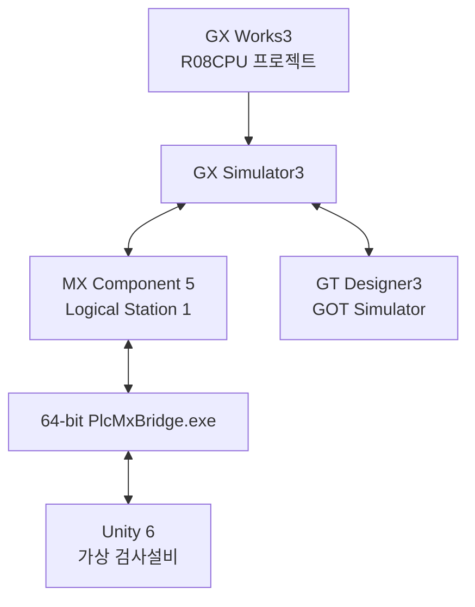
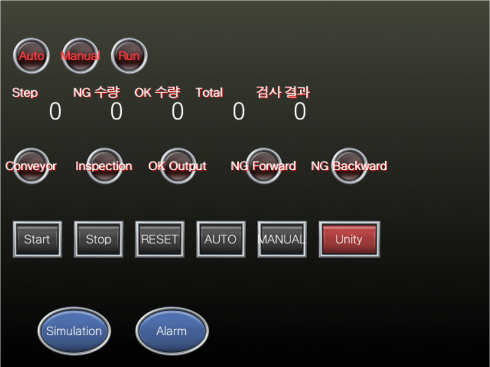
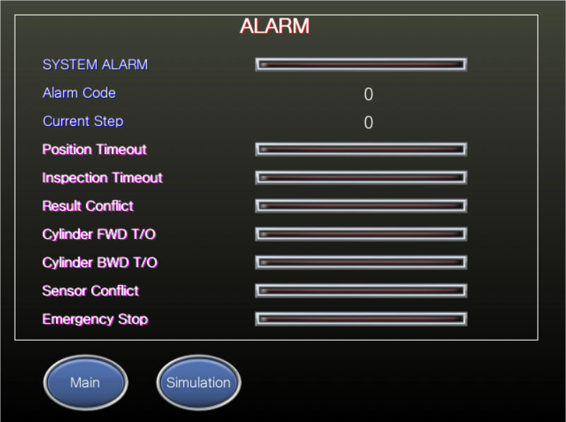
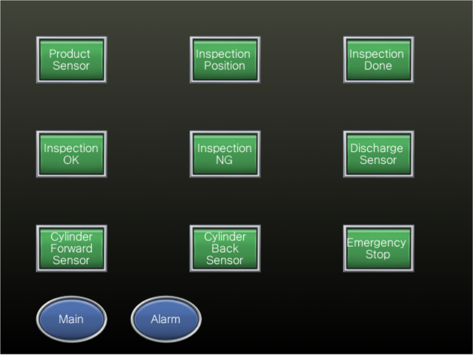

# PLC Virtual Factory

GX Works3와 GX Simulator3로 구현한 가상 검사공정을 GT Designer3의 GOT 화면 및 Unity 3D 설비와 연동한 프로젝트입니다.

PLC가 공정 순서와 인터록을 결정하고, Unity는 제품·컨베이어·검사 위치·배출 실린더를 가상 설비로 표현합니다. Unity와 Mitsubishi MX Component 사이의 COM 호환 문제는 별도의 64비트 C# 브리지인 `PlcMxBridge.exe`로 해결했습니다.



*Unity 가상 검사공정 전체 구성*

## 주요 구현 내용

- GX Works3 기반 자동·수동 운전 및 단계식 시퀀스
- 검사 위치 정지 후 검사 요청과 OK·NG 결과 핸드셰이크
- OK 직진 배출, NG 실린더 배출 및 완료 신호 확인
- 센서·검사·실린더 타임아웃, 상충 신호 검출, 비상정지와 복구
- 생산수량·OK 수량·NG 수량 집계
- GT Designer3 기반 운전·알람 모니터링
- MX Component와 64비트 C# Bridge를 이용한 Unity–PLC 양방향 통신
- 한 사이클 완료 후 다음 제품을 준비하는 자동 반복 생산

## Unity 가상 설비 및 공정 시연

### 제품 이송 및 OK·NG 분기 흐름



제품은 공급 위치에서 검사 위치로 이송됩니다. 검사 결과가 OK이면 컨베이어를 따라 직진 배출되고, NG이면 실린더가 제품을 별도 배출 위치로 밀어냅니다.

### Unity 3D 운전 조작반



Unity 조작반에서는 Auto·Manual 모드, Start·Stop·Reset·비상정지, 운전·알람 상태와 생산수량을 확인할 수 있습니다. 이 조작반은 GT Designer3로 제작한 GOT 화면과 별도로 Unity 설비 안에 구현한 3D 운전 패널입니다.

### 자동 공정 단계별 시연

#### 1. 자동운전 시작



Auto 모드를 선택하고 Start를 입력하면 PLC 운전 상태가 활성화되고 첫 제품 공급을 시작합니다.

#### 2. 검사 위치 이송



제품이 컨베이어를 따라 이동한 뒤 검사 위치 센서에서 정지합니다.

#### 3. 검사 결과 전달



PLC가 검사 요청을 출력하면 Unity가 검사 완료와 OK 또는 NG 결과를 PLC에 전달합니다.

#### 4. OK·NG 분기 배출


OK 제품은 직진 배출되고, NG 제품은 실린더 동작을 통해 별도 위치로 배출됩니다.

#### 5. 자동 반복 생산


배출 완료와 수량 집계 후 별도의 Start 재입력 없이 다음 제품을 공급하며 자동 사이클을 반복합니다.

## 시스템 구성



Unity는 MX Component COM 객체를 직접 생성하지 않습니다. `PlcConnectionTest.cs`가 외부 프로세스로 Bridge를 실행하고, 표준 입력과 표준 출력으로 명령과 결과를 교환합니다.

```text
Tools/PlcMxBridge.cs
        │ csc.exe /platform:x64
        ▼
Assets/Plugins/PlcMxBridge.exe
        │ Process.Start()
        ▼
Assets/Scripts/PLC/PlcConnectionTest.cs
```

Bridge 내부에서는 WinForms의 STA 메시지 루프에서 `ActUtlType64Class`를 생성합니다. MX Component Logical Station 1을 한 번 `Open()`한 뒤 연결을 유지하며 `GetDevice()`와 `SetDevice()`를 처리하고, Unity 종료 시 `Close()`합니다.

지원 명령은 다음과 같습니다.

```text
Unity → Bridge: READ <device>
Unity → Bridge: WRITE <device> <value>
Unity → Bridge: CLOSE

Bridge → Unity: OPEN <result>
Bridge → Unity: READ <device> <result> <value>
Bridge → Unity: WRITE <device> <result>
Bridge → Unity: CLOSE <result>
```

## 공정 동작

```text
제품 공급
→ 컨베이어 이송
→ 검사 위치 정지
→ PLC 검사 요청
→ Unity에서 OK 또는 NG 결과 전달
→ PLC 결과 확인
→ OK 직진 배출 또는 NG 실린더 배출
→ 배출 완료 확인
→ 생산수량 집계
→ 다음 제품 준비 및 자동 반복
```

PLC의 주요 단계는 `D500`으로 관리합니다.

| D500 | 단계 |
|---:|---|
| 0 | 정지·초기 상태 |
| 100 | 제품 공급 대기 |
| 110 | 검사 위치로 이송 |
| 120 | 검사 요청 및 결과 대기 |
| 130 | OK·NG 결과 판정 |
| 200 | OK 배출 |
| 300 | NG 실린더 전진 |
| 310 | NG 제품 배출 확인 |
| 320 | 실린더 후진 |
| 400 | 사이클 완료 및 수량 집계 |

## PLC 프로그램 구성

| 파일 | 역할 |
|---|---|
| `POU_01_IO_MAP.csv` | 실제 입력 `X`, Unity 입력 Word, 내부 논리 입력 `M` 매핑 |
| `POU_02_MODE.csv` | 자동·수동 모드, Start·Stop·Reset 및 운전 상태 |
| `POU_03_SEQUENCE.csv` | `D500` 기반 공정 단계 전환, 결과 분기와 생산수량 집계 |
| `POU_04_ALARM.csv` | 센서·검사·실린더 타임아웃, 상충 신호, 비상정지 및 알람 코드 |
| `POU_04_OUTPUT.csv` | 공정 명령을 실제 출력으로 변환하고 알람·Reset 조건으로 차단 |
| `POU_06_COMM_MAP.csv` | PLC 내부 명령을 Unity 수신 Word `D100`에 매핑 |

GX Works3 원본 프로젝트는 [PLC/PLC_VirtualFactory.gx3](PLC/PLC_VirtualFactory.gx3), 내보낸 프로그램은 [PLC/DeviceMap_csv](PLC/DeviceMap_csv)에서 확인할 수 있습니다.

## Unity–PLC Device Mapping

### PLC → Unity: D100

| Bit | PLC Device | 의미 |
|---:|---|---|
| `D100.0` | `M100` | 컨베이어 구동 명령 |
| `D100.1` | `M101` | 검사 요청 |
| `D100.2` | `M102` | OK 배출 명령 |
| `D100.3` | `M103` | NG 실린더 전진 명령 |
| `D100.4` | `M104` | NG 실린더 후진 명령 |
| `D100.5` | `M50` | Reset 안전 초기화 요청 |

### Unity → PLC: D0

| Bit | PLC Device | 의미 |
|---:|---|---|
| `D0.0` | `M5` | 제품 감지 |
| `D0.1` | `M6` | 검사 위치 감지 |
| `D0.2` | `M7` | 검사 완료 |
| `D0.3` | `M8` | 검사 OK |
| `D0.4` | `M9` | 검사 NG |
| `D0.5` | `M10` | 제품 배출 완료 |
| `D0.6` | `M11` | 실린더 전진 완료 |
| `D0.7` | `M12` | 실린더 후진 완료 |
| `D0.8` | `M14` | Unity 안전 초기화 완료 |

### 운전 명령과 상태

| Device | 의미 |
|---|---|
| `D101.0` | Start |
| `D101.1` | Stop |
| `D101.2` | Reset |
| `D101.3` | Auto 모드 |
| `D101.4` | Manual 모드 |
| `D101.D` | 비상정지 |
| `M400` | Unity 연동 입력 선택 |
| `D500` | 현재 공정 단계 |
| `D600` | 현재 알람 코드 |
| `D10` | 총 생산수량 |
| `D11` | OK 수량 |
| `D12` | NG 수량 |
| `D30` | 검사 결과 코드: 1=OK, 2=NG |

`PlcConnectionTest.cs`는 요청 큐를 사용해 한 번에 하나의 Read·Write 명령만 Bridge로 전송합니다. `Update()`에서 COM 통신을 직접 수행하지 않으며, Bridge 출력은 별도 이벤트에서 큐에 넣고 Unity 메인 스레드에서 반영합니다. `D0`과 `D101`은 필요한 비트만 변경하는 마스크 쓰기를 사용해 다른 신호를 보존합니다.

## GOT 화면







GT Designer3 원본 프로젝트는 [GOT/PLC_VirtualFactory.GTX](GOT/PLC_VirtualFactory.GTX)에서 확인할 수 있습니다.

## 처음 실행하기

### 1. 필수 프로그램 설치

이 프로젝트는 Windows 11 64-bit에서 다음 버전으로 제작하고 실행했습니다.

| 프로그램 | 사용 버전 | 용도 |
|---|---|---|
| GX Works3 / GX Simulator3 | GX Works3 \`1.117X Demo Version\` | PLC 프로젝트 편집 및 R08CPU 시뮬레이션 |
| GT Designer3 / GOT Simulator | GT Designer3 \`1.256S\` | GOT HMI 편집 및 선택적 시뮬레이션 |
| MX Component | \`5.TRIAL (SW5DND-ACT-E)\` | GX Simulator3와 64비트 Bridge 사이의 통신 |
| Unity Hub / Unity Editor | Unity \`6000.5.6f1\` | Unity 가상 설비 실행 |
| .NET Framework | 4.x | \`PlcMxBridge.exe\` x64 컴파일 및 실행 |
| Git | 최신 버전 | 저장소 클론 |

> 위 표는 이 프로젝트에서 검증한 버전입니다. MX Component는 반드시 Windows에 설치되어 COM 서버가 등록되어 있어야 하며, 저장소의 Interop DLL만으로는 대체할 수 없습니다.

GT Designer3와 GOT Simulator는 GOT HMI까지 확인할 때 필요합니다. Unity–PLC 연동만 실행한다면 GOT Simulator는 생략할 수 있습니다.

### 2. 저장소 클론

PowerShell 또는 Git Bash에서 다음 명령을 실행합니다.

\`\`\`powershell
git clone --branch codex/plc-production-floor-hmi --single-branch https://github.com/Hu-tech-hub/PLC_VirtualFactory.git
cd PLC_VirtualFactory
\`\`\`

이 저장소는 Unity 프로젝트 루트이므로 별도의 하위 Unity 폴더를 찾을 필요가 없습니다. 루트에 \`Assets\`, \`Packages\`, \`ProjectSettings\`가 보이면 올바르게 클론된 것입니다.

### 3. Unity 프로젝트 등록

1. Unity Hub를 실행합니다.
2. \`Projects\`에서 \`Add\` 또는 \`Add project from disk\`를 선택합니다.
3. 클론한 \`PLC_VirtualFactory\` 폴더 자체를 선택합니다.
4. Unity Editor \`6000.5.6f1\`로 프로젝트를 엽니다. 해당 버전이 없다면 Unity Hub에서 먼저 설치합니다.
5. 최초 실행 시 패키지와 Asset Import가 끝날 때까지 기다립니다.

### 4. 64비트 Bridge 빌드

Unity에서 Play를 시작하기 전에 저장소 루트에서 PowerShell을 열고 다음 명령을 실행합니다. 이 과정은 \`Tools/PlcMxBridge.cs\`를 64비트 실행 파일로 컴파일하여 Unity가 실행할 위치에 배치합니다.

\`\`\`powershell
$projectRoot = (Get-Location).Path

& "C:\Windows\Microsoft.NET\Framework64\v4.0.30319\csc.exe" /target:exe /platform:x64 /reference:System.Windows.Forms.dll /reference:"$projectRoot\Assets\Plugins\ActUtlType64Lib.dll" /out:"$projectRoot\Assets\Plugins\PlcMxBridge.exe" "$projectRoot\Tools\PlcMxBridge.cs"
\`\`\`

빌드 후 다음 파일이 생성되었는지 확인합니다.

\`\`\`text
Assets/Plugins/PlcMxBridge.exe
\`\`\`

Bridge는 \`[STAThread]\`, WinForms 메시지 루프 및 \`ActUtlType64Lib.dll\` 참조가 필요하므로 반드시 위와 같이 .NET Framework 64비트 컴파일러와 \`/platform:x64\`를 사용합니다.

### 5. GX Works3와 GX Simulator3 실행

1. GX Works3에서 [PLC 프로젝트](PLC/PLC_VirtualFactory.gx3)를 엽니다.
2. GX Simulator3를 시작합니다.
3. PLC 프로그램과 파라미터를 시뮬레이터에 쓴 뒤 CPU를 \`RUN\` 상태로 전환합니다.
4. Device/Buffer Memory Batch Monitor 등에서 \`D500\`, \`D0\`, \`D100\`, \`D101\`, \`M400\`을 등록하면 이후 Unity 연동에 따른 PLC 값 변화를 함께 확인할 수 있습니다.

### 6. MX Component 통신 경로 확인

MX Component 설치 시 함께 설치되는 **Communication Setup Utility**를 실행합니다.

1. Logical Station Number \`1\`을 선택하거나 새로 등록합니다.
2. 통신 대상을 현재 실행 중인 GX Simulator3로 설정합니다.
3. 설정을 저장합니다.
4. \`Connection Test\`를 실행하여 Logical Station 1과 GX Simulator3의 연결이 성공하는지 확인합니다.

GX Simulator3가 먼저 실행되어 있어야 연결 시험이 가능합니다. Bridge 코드도 Logical Station Number \`1\`을 사용하므로 다른 번호로 설정하면 Unity에서 PLC를 열 수 없습니다.

### 7. GOT HMI 확인(선택)

GOT 화면도 확인하려면 GX Simulator3가 실행 중인 상태에서 다음 순서로 진행합니다.

1. GT Designer3에서 [GOT 프로젝트](GOT/PLC_VirtualFactory.GTX)를 엽니다.
2. GOT Simulator를 실행합니다.
3. GOT Simulator가 GX Simulator3의 R08CPU 프로젝트와 연결되는지 확인합니다.
4. 메인 운전 화면, 알람 화면 및 PLC Device 값 변화를 확인합니다.

GOT Simulator는 Unity–PLC 통신의 필수 구성 요소가 아니므로 필요할 때만 실행하면 됩니다.

### 8. Unity–PLC 연결 확인

1. Unity Editor에서 \`Game\` 탭을 연 뒤 상단의 Play 버튼을 누릅니다.
2. \`PlcConnectionTest.cs\`가 \`Assets/Plugins/PlcMxBridge.exe\`를 자동 실행하고 MX Component Logical Station 1을 엽니다.
3. Hierarchy에서 \`PLCCommunication Test\` GameObject를 선택합니다.
4. Inspector의 \`PLC Status\`에서 \`Connected\`가 체크되고 \`Last Open Code\`가 \`0x00000000\`인지 확인합니다.
5. GX Simulator3에서 \`M400\`을 \`TRUE\`로 강제 변경하여 PLC가 Unity 통신 입력을 사용하도록 전환합니다.

> \`Connected\`는 Unity–Bridge–MX Component 통신 연결 상태이고, \`M400\`은 PLC의 **Unity 연동 입력 선택**입니다. 두 항목은 역할이 다릅니다.

연결되지 않으면 Unity Console의 \`[PLC TEST]\` 및 \`[BRIDGE]\` 로그, Inspector의 \`Last Open Code\`, 그리고 Communication Setup Utility의 Logical Station 1 설정부터 확인합니다.

### 9. 자동 공정 시연

연결 확인 후 Unity의 3D 운전 조작반을 사용합니다.

1. Auto 모드를 선택합니다.
2. Start를 입력합니다.
3. 제품이 검사 위치까지 이송되어 정지하는지 확인합니다.
4. 검사 요청 후 조작반에서 OK 또는 NG 결과를 입력합니다.
5. 결과에 따라 OK 직진 배출 또는 NG 실린더 배출이 수행되는지 확인합니다.
6. 생산수량이 증가하고 다음 제품이 자동으로 준비되는지 확인합니다.

키보드 \`O\`/\`N\` 입력은 중간 개발 단계의 시험 방식이므로 최종 실행 절차에서는 사용하지 않습니다. 위의 [자동 공정 단계별 시연](#자동-공정-단계별-시연) GIF를 따라 조작하고, GX Simulator3에서 \`D500\`, \`D0\`, \`D100\`, \`D101\`, \`D10\`~\`D12\` 값이 함께 변하는지 확인하면 전체 폐루프 동작을 검증할 수 있습니다.

## 저장소 구조

```text
PLC_VirtualFactory/
├─ Assets/
│  ├─ Plugins/                 # Bridge EXE와 MX Component Interop DLL
│  └─ Scripts/
│     └─ PLC/                  # Unity 통신 및 공정 연동 코드
├─ Diagnostics/
│  └─ BridgeAB/                # 통신 문제를 분리한 A/B 진단 코드
├─ Packages/                   # Unity 패키지 설정
├─ ProjectSettings/            # Unity 프로젝트 설정
├─ Tools/
│  └─ PlcMxBridge.cs           # 최종 Bridge 원본 소스
├─ PLC/
│  ├─ PLC_VirtualFactory.gx3   # GX Works3 원본 프로젝트
│  └─ DeviceMap_csv/           # POU별 프로그램 내보내기
├─ GOT/
│  └─ PLC_VirtualFactory.GTX   # GT Designer3 원본 프로젝트
└─ docs/
   ├─ demos/                   # 단계별 Unity 실행 GIF
   └─ images/
      ├─ unity/                # 전체 설비·공정 흐름·3D 조작반 이미지
      └─ got/                  # GOT 운전·알람·Simulator 화면
```

## 문제 해결 핵심

Unity에서 MX Component를 직접 호출하는 과정에서는 다음 문제가 발생했습니다.

- 32비트 COM 객체와 64비트 Unity Editor 간 비트 수 불일치
- .NET용 래퍼 사용 시 `Open()` 또는 Device Read 오류
- 콘솔 STA 스레드만 사용했을 때 `Open()`이 반환되지 않는 현상
- Unity 메인 스레드에서 동기 통신할 경우 발생할 수 있는 프레임 정지

Mitsubishi 공식 C# 샘플이 `[STAThread]`와 WinForms 메시지 루프에서 `ActUtlType64Class`를 생성하는 구조임을 확인한 뒤, 동일 조건을 외부 64비트 Bridge에 적용했습니다. Unity는 Bridge 프로세스와 비동기적으로 통신하므로 MX Component COM 객체를 직접 다루지 않습니다.

## 상세 개발 기록

### 프로젝트 실습

1. [1주차 | PLC·GOT 기본 시퀀스 구현](https://yeobi0106.tistory.com/35)
2. [2주차 | 알람·인터록·비상정지·복구 로직 구현](https://yeobi0106.tistory.com/36)
3. [3주차 ① | Unity에서 MX Component로 GX Simulator3 직접 연결 시도하기](https://yeobi0106.tistory.com/37)
4. [3주차 ② | PlcMxBridge로 Read·Write 통신 구현](https://yeobi0106.tistory.com/38)
5. [3주차 ③ | PlcMxBridge.exe 최종 분석](https://yeobi0106.tistory.com/39)
6. [4주차 ① | Device Mapping과 첫 폐루프](https://yeobi0106.tistory.com/40)
7. [4주차 ② | 검사 요청과 OK·NG 결과 전달](https://yeobi0106.tistory.com/41)
8. [4주차 ③ | 제품 배출과 자동 반복 생산](https://yeobi0106.tistory.com/42)

### GX Works3 입문

1. [PLC 기초부터 프로젝트 구성까지](https://yeobi0106.tistory.com/32)
2. [시스템 파라미터와 디바이스, 시뮬레이션](https://yeobi0106.tistory.com/33)
3. [자기유지부터 비교·사칙연산까지](https://yeobi0106.tistory.com/34)

## 범위

이 프로젝트는 실제 PLC와 실제 생산설비 대신 GX Simulator3 및 Unity를 이용해 PLC–HMI–가상 설비의 제어 흐름을 검증한 가상 FAT 실습입니다. 검사 결과는 Unity에서 수동으로 입력하며, 실제 비전 알고리즘을 이용한 판정은 포함하지 않습니다.
